  - [Motivation](#motivation)
  - [Beliefs as a probability
    distribution](#beliefs-as-a-probability-distribution)
  - [Updating beliefs with data and a simulation
    model](#updating-beliefs-with-data-and-a-simulation-model)
  - [How ABC works: iterated
    accept-reject](#how-abc-works-iterated-accept-reject)
  - [Practice: Using ABC in OpenMOLE](#practice-using-abc-in-openmole)
  - [Practice: Exploiting ABC’s
    output](#practice-exploiting-abcs-output)
  - [Practice: Estimating the posterior
    density](#practice-estimating-the-posterior-density)
  - [Practice: Hypothesis testing](#practice-hypothesis-testing)
  - [Practice: Forecasting](#practice-forecasting)
  - [Choosing summary statistics or the curse of
    dimensionality](#choosing-summary-statistics-or-the-curse-of-dimensionality)

# Motivation

Calibration is about tuning a model parameter values. Generally, we want
to set values that are consistent with data. One example, typical of the
way we do it in OpenMOLE, is when we don’t have any data with which we
can directly compute parameter values (e.g. by taking the mean of the
data), but have data that we can compare to the model output. The
problem of calibration is then to estimate parameter values with which
the model output reproduces the data.

The objective of ABC is to account for uncertainty when performing
calibration. We have already approached calibration using optimisation
with NSGA2, but it is little equipped to deal with the model
stochasticity. Optimisation-based calibration searches for parameter
values which minimize a distance between the model output and the data.
When the model is stochastic the distance can vary from one simulation
run to the next, even though the parameter values are kept constant.
How, then, can we chose the parameter values with the smallest distance
when they don’t always give the same? With NSGA2, we usually run several
simulations with the same parameter values and compare the data to the
median or average over the replications. We are circumventing the
problem by using quantities that are more stable than individual
simulation outputs. But the median or average is not always
representative of the model individual output (think of a model output
which has a bimodal distribution). Moreover, we are deliberately
discarding information about the model randomness, and that information
is valuable.

Randomness in a model expresses our uncertainty about the underlying
processes. Recall the zombie model. To represent the sharing of
information about a rescue zone by a probability of successful sharing
(parameter `humanInformProbability`) reflects that we don’t really know
the conditions for successful communication. It can depend on each
person’s physical and mental states, or on the situation where they
meet. Our model isn’t designed for that level of detail, but if we
believe that it is successful more often than not, we may want to set
this parameter to a value greater than 0.5.

As a consequence, a model run with a given parameter value may or may
not yield an output that reproduces the data, and we can describe the
chance that it does with a probability.

Because of that, the calibration result is also uncertain. If our data
contains clues that information sharing is successful most of the time,
we will lean towards believing that higher values of
`humanInformProbability` are more likely than lower values. But low
values remain nonetheless possible.

Uncertainty is a valuable information when making scientific statements.
It helps us avoid making misleading claims, for example, when estimating
parameter values or forecasting. For example, when estimating a
parameter like `humanInformProbability` that takes values between 0 and
1, we can convey the degree of uncertainty by giving an interval of
values within which we believe the value lies. To say that it lies
between 0.5 and 0.6 is very different from saying it lies between 0.2
and 0.9. We are not likely to draw the same conclusions nor to take the
same decisions based on one or the other.

Calibrating a model using ABC allows us to be explicit about how
uncertain or confident we are about our conclusions. It estimates a
probability distribution describing the belief in the different
parameter values to fit the data. Before observing any data, we may or
may not already have some ideas about which parameter values are more
likely than others. Data can contradict or confirm them. This is the
general scheme of approximate Bayesinan computation (ABC), and more
generally Bayesian inference: state initial beliefs about parameter
values and update them with data and a model.

# Beliefs as a probability distribution

Using ABC, we try to characterize beliefs in the values that can take
the parameters. We can describe those beliefs with a probability
distribution: the most probable values will be associated with higher
probabilities. For example, consider the parameter
`humanInformProbability`. It is real valued in the interval \([0,1]\), a
probability distribution describing our belief about it is characterized
by a density function which we write

\(f_\texttt{humanInformProbability}: [0,1] \rightarrow \mathbb{R}_+\).

It associates to each possible value a positive real value, the density,
which describes how likely this value is relative to the others. A flat
function gives all values the same density. It reflects that all value
are believed equally likely. When the shape isn’t flat, some values are
more credible than others. A density value equal to 0 means that the
associated parameter value are believed to be impossible.


A high degree of confidence can be translated as a narrow distribution,
peaked around the value on which we would put our bet. A lower degree of
confidence would be associated to a wider distribution and a lower peak.


Such density functions will describe *prior* and *posterior* beliefs
about the parameters, i.e. respectively beliefs we have about them
before observing any data and beliefs updated with data and the model.
We call them respectively *prior density* and *posterior density*. The
former is generally constructed by hand to reflect our state of belief
based on prior data or theoretical knowledge. The latter is the result
of ABC. For example, the posterior density on the parameter
`humanInformProbability` given a `proportionInfected` equal to \(a\)
will be denoted with a conditional density function like

\[f_{\texttt{humanInformProbability} | \texttt{proportionInfected} = a}:[0,1] \rightarrow \mathbb{R}_+\].

The model zombie takes 3 parameters (`humanInformedRatio`,
`humanInformProbability` and `humanFollowProbability`) and outputs
multiple values (these will depend on the case study). For simplicity,
we will abstract over the parameters and output values by representing
them respectively with the random variables \(\Theta\) and \(Y\), both
being multidimensional real-valued. The lowercase letter \(\theta, y\)
will refer to individual realizations. With this notation, the prior and
posterior density are written \(f_\Theta\) and \(f_{\Theta|Y = y_0}\),
where \(y_0\) denotes the observed data.

# Updating beliefs with data and a simulation model

We want to use prior beliefs over parameter values, observed data and
the model to refine our beliefs and obtain the posterior density on the
parameters. According to Bayes formula, the posterior density is
proportional to the prior density times another term called the
likelihood:

\(f_{\Theta | Y = y_0}(\theta) \propto f_{Y| \Theta = \theta}(y_0) f_\Theta(\theta).\)

The prior distribution term is \(f_\Theta(\theta)\). It is usually
constructed by hand to reflect our subjective state of knowledge over
the parameter. Often, we assume no prior knowledge by using a uniform
distribution over a reasonnable range of values. That range must be
chosen carefully, since any parameter value outside of it — where the
prior density is 0 — will also have a posterior density equal to 0, even
if the data may suggest otherwise.

The likelihood term is \(f_{Y|\Theta=\theta}(y_0)\). It gives the
density of a model output value equal to the observed data \(y_0\),
given the parameter values \(\theta\).

With complex systems models, we may not know how to compute the
likelihood directly. But the likelihood is indirectly expressed by a
stochastic model: running multiple model simulations keeping the
parameter value \(\theta\) constant and collecting the output values
\(y_1, y_2, \dots\) is equivalent to sampling from the distribution of
\(Y|\Theta=\theta\). ABC aims precisely at approximating the posterior
distribution when we cannot compute the likelihood directly but can
sample from it with a simulation model.

The resulting posterior density value, \(f_{\Theta | Y = y_0}(\theta)\)
describes the updated belief that we want to compute. It is the belief
on the values that can take the parameter, consistent with both the
prior belief and the likelihood. It combines the information they
contain.

# How ABC works: iterated accept-reject

The simple, general idea of ABC is to sample many parameter values from
the prior distribution, run one simulation for each and keep those whose
output values are equal to the observed data \(y_0\). The resulting
sample \(\theta_1, \dots, \theta_n\) follows the posterior distribution
of \(\Theta | Y = y_0\).

With a real-valued output \(Y\), keeping only the simulations whose
output is equal to \(y_0\) is not possible. Instead, we keep those whose
outputs are within a euclidean distance \(\epsilon\) of \(y_0\). It
means that ABC actually samples from the distribution of
\(\Theta | \rho(Y, y_0) < \epsilon\), where \(\rho(Y,y_0)\) is the
euclidean distance between the model output \(Y\) and the observed data
\(y\). We assume that \(\Theta | \rho(Y, y_0) < \epsilon\) is a good
approximation of \(\Theta | Y = y\) when \(\epsilon\) is small.

The approach of Lenormand, Jabot and Deffuant (2012)\[1\] implemented in
OpenMOLE tries to make \(\epsilon\) as small as possible step by step:

  - Sample \(N\) values \(\theta_1, \dots,\theta_N\) from the prior
    distribution and run one simulation for each to get the sequence of
    pairs \(S = (\theta_1, y_1), \dots, (\theta_N, y_N)\),
  - Repeat
      - Sample \(N'\) parameter values and run the simulations resulting
        in a sequence of \(N'\) pairs
        \(S' = (\theta'_1, y'_1), \dots, (\theta'_{N'}, y'_{N'})\)
      - Replace \(S\) by the \(N\) pairs from \(S\) and \(S'\) with the
        lowest distance from the data \(y\).

There, \(\epsilon\) is implicitly determined by the highest distance
between a simulation output and the data, among the \(N\) simulations
kept at each step.

As the algorithm progresses, \(\epsilon\) will decrease and it will
become more and more difficult to generate new simulations that are
within a distance \(\epsilon\) to the data. We chose to terminate the
algorithm when the proportion of simulation accepted among the
\(m_\textit{stop} \times N\) last simulations (which can be greater than
\(N'\)) decreases below a parameter \(p_\textit{Acc}\).

# Practice: Using ABC in OpenMOLE

In the OpenMOLE interface, download the entry “ABC” from the market
place and have a look at the script `abc.oms`. This script applies ABC
to a toy model, a gaussian mixture, but we won’t focus on it here. Note
only that it takes three parameters and outputs a 3-dimensional vector.
Try to guess what parameters passed to the function `IslandABC`
correspond to ABC’s parameters discussed previously (note the
distinction between the model parameters and ABC’s parameters). Hint:
ABC’s parameters are the prior distribution, the observed data, the
sample sizes \(N\) and \(N'\), \(p_\textit{Acc}\) and
\(m_\textit{stop}\).

Run the script. It should take about 3 minutes. Refresh the file list on
the left (look at the buttons above the list). The directory
“posteriorSample” should appear. It contains the posterior sample
given by ABC at each timestep. The last one is the final sample (you can
sort the files by date). Open this file. Each row is a sample point.
There is a column for each parameter (here, they are named “theta1”,
“theta2” and “theta3”). Recall that this is a weighted sample, and the
weights are given in the column “weight”. The column “rhos” gives the
euclidean distance that was computed between the simulation output and
the observed data.

Use your favorite method to make a scatter plot of the posterior sample,
taking the parameters two by two. Recall that you can do it in only a
few clicks in openmole, if you click on the button “Plot” above the
current table. Which parameter values seem the most credible, given the
data?

Remember the model zombies with the 3 parameters `humanInformedRatio`,
`humanInformProbability` and `humanFollowProbability`. Write an openmole
script that runs ABC on it. Use as observed data the time series of
people rescued every 20 seconds:
`Array(0,5,14,42,36,9,5,3,1,0,0,0,0,0,0,0,0,0,0,0,0,0,0,0,0,0)`

The solution is available
[here](openmole/cooperation/abc_practice_solution.oms).

# Practice: Exploiting ABC’s output

We have defined calibration as finding parameter values consistent with
data. We’ve seen that, with ABC, we are aiming at a calibration
procedure that accounts for uncertainty. How does the result of ABC
convey uncertainty, and how do we use it?

ABC conveys uncertainty through a sample of values. It follows the
posterior density distribution on the parameter given the data. This
distribution represents how probable the different parameter values are,
according to the data, the model, and the prior distribution.

The posterior sample is composed of the sequence of parameter values
\((\theta_i)_{i=1}^N\) and their associated weights \(w_i\). For
example, [this file](samples/step872.csv) contains the result of ABC for
the model coop, where the data is a sequence of number of people rescued
every 20 seconds. Each row corresponds to one point in the sample. The
columns `humanInformedRatio`, `humanInformProbability` and
`humanFollowProbability` give the values for the corresponding
parameters, and the column `weight` give the point’s weight.

The OpenMOLE task used to obtain this result is (see the [solution to
the previous section for the complete OpenMOLE
script](openmole/abc_practice_solution.oms)):

``` scala
val abc =
  IslandABC(
    evaluation = model,
    prior = Seq(
      humanInformedRatio in (0.0, 1.0),
      humanInformProbability in (0.0, 1.0),
      humanFollowProbability in (0.0, 1.0)),
    observed =  Seq(rescuedDynamic -> Array(0,5,14,42,36,9,5,3,1,0,0,0,0,0,0,0,0,0,0,0,0,0,0,0,0,0)),
    sample = 1000,
    generated = 100,
    minAcceptedRatio = 0.01,
    stopSampleSizeFactor = 5,
    parallelism = 300
  )
```

**Practice:** Use your favorite scripting language to compute the
expected value of the parameters. Remember that the sample is weighted.
What can you say about this expected value? On its own, does it tell you
much about the distribution of parameters given the data? Hint: we would
at least like to know how wide is the distribution around this value.

# Practice: Estimating the posterior density

The first thing we would like to do with the result of ABC is to develop
some intuition about which parameter values are the most likely, and
which are not. We have a posterior sample, but the posterior density
could help us.

We can estimate the posterior density from a sample using kernel density
estimation. Let’s estimate the posterior density within the context of
the [previous section](#practice-exploiting-abcs-output). The posterior
density is \(f_{\Theta | Y = y_0}\) where \(\Theta\) denotes the three
parameters `humanInformedRatio`, `humanInformProbability` and
`humanFollowProbability`, and \(y_0\) denotes the following sequence of
number of people rescued every 20 seconds:

\((0,5,14,42,36,9,5,3,1,0,0,0,0,0,0,0,0,0,0,0,0,0,0,0,0,0)\)

The R script generating the figures of this section is available
[here](report/abc-report.Rmd). The data file containing the posterior
sample is [here](samples/step872.csv).

The easiest way to develop intuition about data is through
visualisation. Ideally, we would like to plot the posterior density as
seen in section [Beliefs as a probability
distribution](#beliefs-as-a-probability-distribution).

Let’s recall that the model coop has 3 parameters. Since each point in
the parameter space has an associated density value, the posterior
density is in 4 dimensions. But visualizing 4D data is difficult. To
begin with, we can visualise the density of each parameter individually
(their marginal densities), as well as each pair of parameters.

Here are the estimated density of individual parameters:

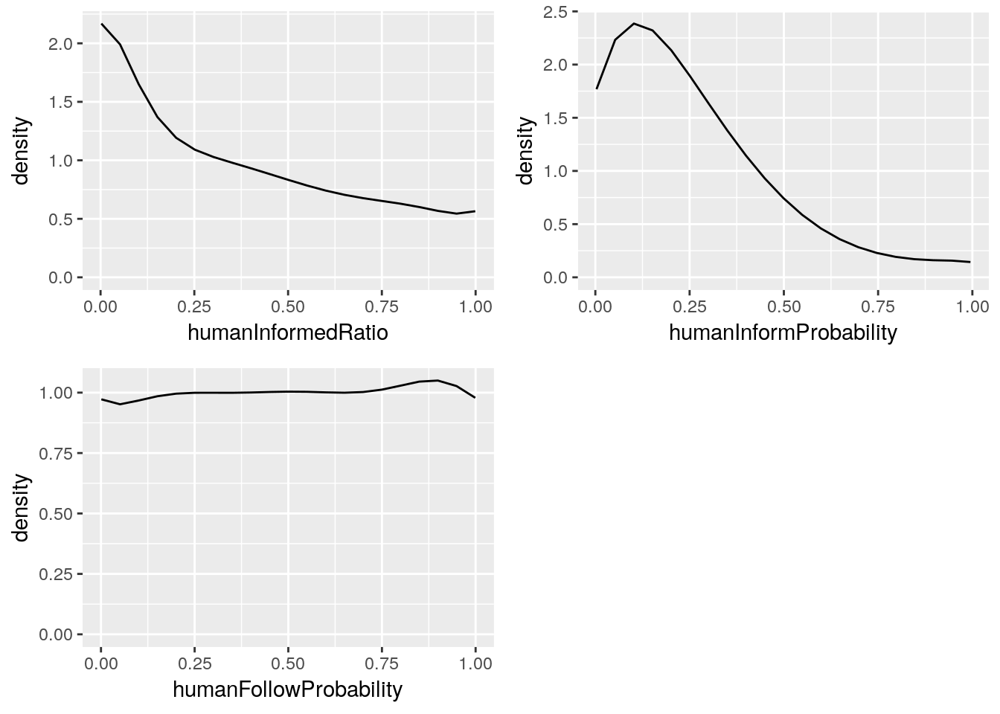

From these densities we can say that:

  - Small values of the parameter `humanInformProbability` are more
    likely than large values. The most likely values are around 0.1.
  - Small values of the parameter `humanInformedRatio` are more likely
    than large values. The values closest to 0 are the most likely.
  - All values of the parameter `humanFollowProbability` are equally
    likely. The parameter doesn’t seem to influence the probability that
    the model output is close to the data.

While individual marginals give us some insight, they can hide
information of interaction between parameters. Let’s examine
interactions of parameters 2 by 2:

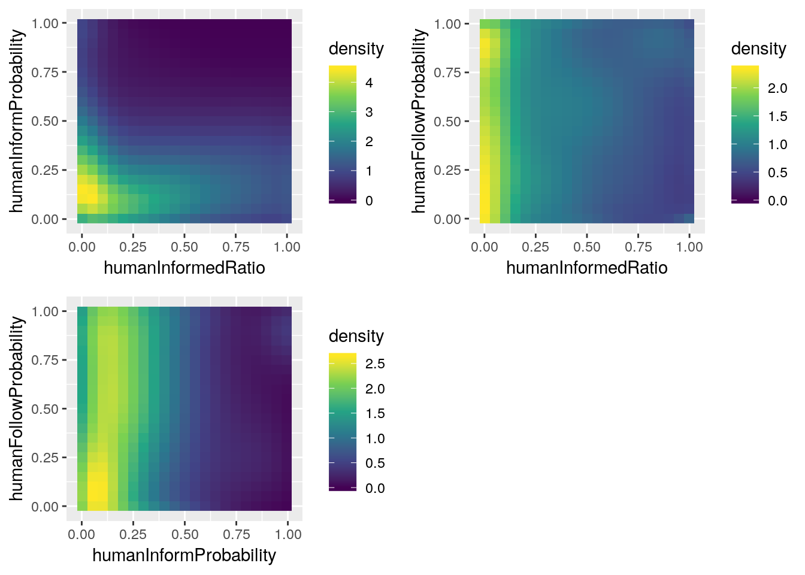

These densities of parameters taken 2 by 2 confirm our previous
intuitions:

  - the parameter `humanFollowProbability` doesn’t seem to influence how
    likely each other parameter is: it’s value doesn’t affect the
    marginal density of any of the other 2 parameters;
  - the most likely values of the parameter are still close to 0 for the
    parameter `humanInformedRatio` and close to 0.1 for the parameter
    `humanInformProbability`.

Finally, let’s look at the peaks in the density of all 3 parameters
together (the full joint posterior distribution).

    ## # A tibble: 5 x 4
    ##   humanInformedRatio humanInformProbability humanFollowProbability density
    ##                <dbl>                  <dbl>                  <dbl>   <dbl>
    ## 1            0.00205                  0.102               0.0508      5.35
    ## 2            0.0519                   0.102               0.849       4.23
    ## 3            0.00205                  0.995               0.899       2.81
    ## 4            0.850                    0.251               0.899       1.85
    ## 5            0.999                    0.301               0.000935    1.28

The two highest peaks of density are close with respect to the variables
`humanInformedRatio` and `humanInformProbability` but far away with
respect to the parameter `humanFollowProbability`. This is consistent
with our previous observations, i.e. the location of the most likely
values of parameters `humanInformedRatio` and `humanInformProbability`,
and the flat density on the parameter `humanFollowProbability`.

**Practice:** You can get to similar results using histograms, which are
simpler to program. Using your favorite scripting language, compute the
equivalent of the 1D marginal above with histograms. Remember that the
sample is weighted\!

# Practice: Hypothesis testing

Imagine that before people entered the stadium, the managers took
measures to inform everyone about the rescue points. For example, they
broadcasted an announcement at the beginning of the show. After the
tragic event, they want to know if the message was clear enough that at
least half of the people had the information.

With the posterior density, we can compute the probabilities that
`humanInformedRatio` was respectively greater than and less than 0.5,
and compare them.

The probability that `humanInformedRatio` is greater than 0.5, according
to the posterior density, is:

\(\mathbb{P}(\textit{humanInformedRatio} > 0.5 | Y = y_0) = \int_{0.5}^1 f_{\textit{humanInformedRatio}|Y=y_0}(x)dx,\)

where \(y_0\) is the observed sequence of number of rescues. This can be
approximated with the weighted sample that we got from ABC by:

\(\mathbb{P}(\textit{humanInformedRatio} > 0.5 | Y = y_0) \approx \frac{1}{\sum_{i=1}^n w_i} \sum_{i=1}^n w_i \textbf{1}_{[0.5,1]}(\textit{humanInformedRatio}_i)\)

Where \(w_i\) is the weight associated to the \(i\)-th sample point,
\(\textbf{1}\) is the indicator function
(\(\textbf{1}_{[0.5, 1]}(\textit{x}) = 1\) if
\(\textit{x} \in [0.5,1]\), \(0\) otherwise),
\(\textit{humanInformedRatio}_i\) is the value of the parameter
`humanInformedRatio` of the \(i\)-th sample point.

Similarly, the probability that `humanInformedRatio` was less than 0.5
is approximated by:

\(\mathbb{P}(\textit{humanInformedRatio} < 0.5 | Y = y_0) \approx \frac{1}{\sum_{i=1}^n w_i} \sum_{i=1}^n w_i \textbf{1}_{[0,0.5]}(\textit{humanInformedRatio}_i)\)

**Practice:** We ran ABC with the settings used
[previously](#practice-exploiting-abcs-output). Use the posterior sample
in [this file](samples/step872.csv) and your favorite scripting language
to compute the ratio
\(\frac{\mathbb{P}(\textit{humanInformedRatio} > 0.5 | Y = y_0)} {\mathbb{P}(\textit{humanInformedRatio} < 0.5 | Y = y_0)}\).

This ratio tells us how much more probable is the hypothesis that more
than half the humans were informed that the alternative. What can you
conclude about the hypothesis that at least half of the people were
aware of the rescue zones?

# Practice: Forecasting

We can make predictions consistent with our inference’s uncertainty
using the posterior sample. If we run a simulation using the parameter
values from each row in the posterior sample and take each output value,
we get a prediction sample. This sample follows the distribution of
output values predicted by the inferred model.

For example, the expected value of the predicted total number of people
rescued during an attack according to the inferred model is approximated
by

\(\mathbb{E}[\textit{totalRescued}|Y=y] = \sum_{i=1}^n \frac{w_i}{\sum_{j=1}^n w_j} \textit{totalRescued}_i\)

Where \(\textit{totalRescued}_i\) is the total number of people rescued
for the simulation run corresponding to the \(i\)-th posterior sample
point, and \(w_i\) is the associated weight.

**Practice:** [This file](samples/posteriorPredictionTotalRescued.csv)
contains the prediction sample of the total number of rescues, obtained
from the [posterior sample](samples/step872.csv) used
[previously](#practice-exploiting-abcs-output). It was obtained using
[this OpenMOLE script](openmole/abc_predict_totalRescued.oms). Compute
the predicted 5-percentile and 95-percentile of the total number of
people rescued. Based on the width of this interval, how confident are
you to make a prediction?

Does the observed data fall within the 90% prediction interval you just
computed? This is called a posterior predictive check. Such tests are
important. They consist in making sure that the observed data is
sufficiently likely according to the inferred model. If not, then there
may be a problem with the model or the inference.

# Choosing summary statistics or the curse of dimensionality

ABC’s success depends on the information we use to compare the model
output and the data. [We have
seen](#how-abc-works-iterated-accept-reject) that ABC samples from the
distribution of \(\Theta | \rho(Y,y_0) < \epsilon\), where
\(\rho(Y,y_0)\) is the euclidean distance between the model output and
the data. We use this distribution as an approximation of the
distribution of \(\Theta | Y = y_0\), which we are ideally interested
in. In order for this approximation to be reasonable, \(\epsilon\) must
be small. The euclidean distance is affected by what information is
contained in the values of \(Y\) and \(y_0\), called the *summary
statistics*.

Previously, we ran ABC on the model zombie using as summary statistics
the sequence of number of rescues every 20 seconds. It forms a vector of
26 values. Alternatively, we could have used more detailed information,
such as the number of rescues every second, forming a vector in about
500 dimensions. Or we could have used more aggregated information, like
the total number of rescues for the whole simulation.

In order for ABC to work well, the summary statistics needs to satisfy
two constraints: be *sufficient* for the parameters, and avoid the curse
of dimensionality.

A summary statistics is sufficient for a parameter if they provide as
much information as the full dataset to estimate the parameter. It would
be tempting to add as much information as possible into the summary
statistics, but as we do so, ABC suffers from the curse of
dimensionality.

As the number of dimensions increases, it becomes more difficult to get
small values for \(\epsilon\). Recall that the [fondamental principle of
ABC](#how-abc-works-iterated-accept-reject) is to sample parameter
values from the prior distribution and keep those which result in an
output close to the observed data. The curse of dimensionality implies
that the chance of sampling output values close to the observed data
decreases as the number of dimensions increases, affecting the value of
\(\epsilon\). Since ABC samples from the distribution of
\(\Theta | \rho(Y, y_0) < \epsilon\), aiming for small \(\epsilon\) to
approximate \(\Theta | Y = y_0\), the approximation deteriorates.

Let’s compare the estimated posterior marginal densities of each
parameter from the result of ABC using respectively the total number of
rescues (\(\in \mathbb{R}\)), the number of rescues every 20 seconds
(\(\in \mathbb{R}^{26}\)) and the number of rescues every second
(\(\in \mathbb{R}^{500}\)):

**Total number of rescues:**

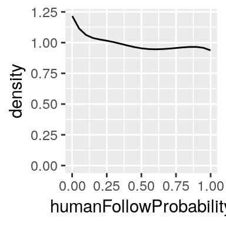
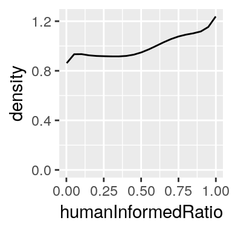
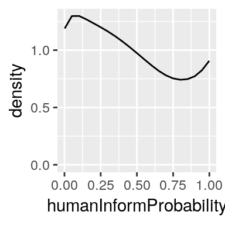

**Number of rescues every 20 seconds:**

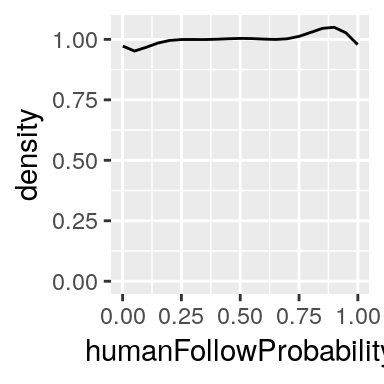
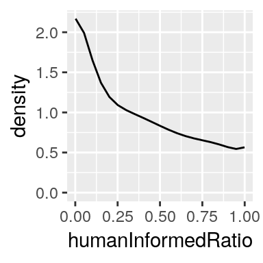
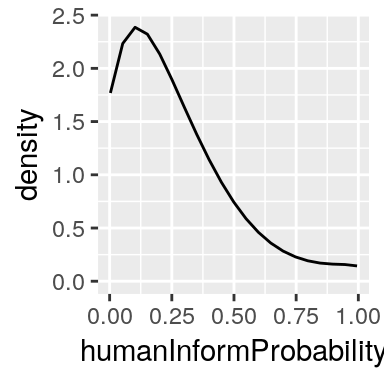

**Number of rescues every second:**

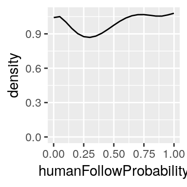
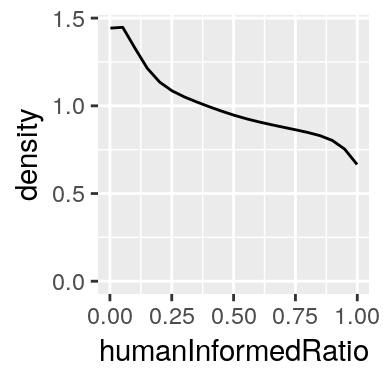
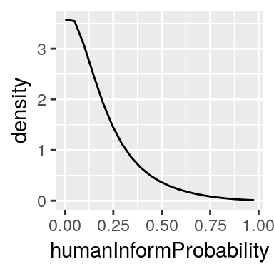

There are notable differences between the estimated marginals. In the
first row, the three marginals are almost flat, suggesting that the
summary statistic is not sufficient for the parameters. The second and
third rows differ in the peak of the marginal for the parameter
`humanInformProbability`: it is located around 0.1 in the second row and
close to 0 in the third. Without any knowledge about the expected
density that we are trying to estimate, it is hard to know which one is
the most accurate.

A strategy to evaluate the quality of the whole inference process is to
use simulation to generate pairs of parameter values and output values,
and compare the result of ABC on each output value to the corresponding
parameter value. The observed data we used in the previous applications
of ABC was actually generated by a simulation run using the value 0.09
for `humanInformProbability`. We are thus tempted to say that using the
summary statistics in 20 dimensions gives better results than using the
most detailed summary statistics in 500 dimensions.

1.  Source: Lenormand, M., Jabot, F. & Deffuant, G. Comput Stat (2013)
    28: 2777. https://doi.org/10.1007/s00180-013-0428-3
