Motivation
===

Calibration is about tuning a model parameter values. Generally, we want to set values that are consistent with data. One example, typical of the way we do it in OpenMOLE, is when we don't have any data with which we can directly compute parameter values (e.g. by taking the mean of the data), but have data that we can compare to the model output. The problem of calibration is then to estimate parameter values with which the model output reproduces the data.

The objective of ABC is to account for uncertainty when performing calibration. We have already approached calibration using optimisation with NSGA2, but it is little equipped to deal with the model stochasticity. Optimisation-based calibration searches for parameter values which minimize a distance between the model output and the data. When the model is stochastic the distance can vary from one simulation run to the next, even though the parameter values are kept constant. How, then, can we chose the parameter values with the smallest distance when they don't always give the same? With NSGA2, we usually run several simulations with the same parameter values and compare the data to the median or average over the replications. We are circumventing the problem by using quantities that are more stable than individual simulation outputs. But the median or average is not always representative of the model individual output (think of a model output which has a bimodal distribution). Moreover, we are deliberately discarding information about the model randomness, and that information is valuable.

Randomness in a model expresses our uncertainty about the underlying processes. Recall the zombie model. To represent the sharing of information about a rescue zone by a probability of successful sharing (parameter `humanInformProbability`) reflects that we don't really know the conditions for successful communication. It can depend on each person's physical and mental states, or on the situation where they meet. Our model isn't designed for that level of detail, but if we believe that it is successful more often than not, we may want to set this parameter to a value greater than 0.5.

As a consequence, a model run with a given parameter value may or may not yield an output that reproduces the data, and we can describe the chance that it does with a probability. 

Because of that, the calibration result is also uncertain. If our data contains clues that information sharing is successful most of the time, we will lean towards believing that higher values of `humanInformProbability` are more likely than lower values. But low values remain nonetheless possible.

Uncertainty is a valuable information when making scientific statements. It helps us avoid making misleading claims, for example, when estimating parameter values or forecasting. For example, when estimating a parameter like `humanInformProbability` that takes values between 0 and 1, we can convey the degree of uncertainty by giving an interval of values within which we believe the value lies. To say that it lies between 0.5 and 0.6 is very different from saying it lies between 0.2 and 0.9. We are not likely to draw the same conclusions nor to take the same decisions based on one or the other.

Calibrating a model using ABC allows us to be explicit about how uncertain or confident we are about our conclusions. It estimates a probability distribution describing the belief in the different parameter values to fit the data. Before observing any data, we may or may not already have some ideas about which parameter values are more likely than others. Data can contradict or confirm them. This is the general scheme of approximate Bayesinan computation (ABC), and more generally Bayesian inference: state initial beliefs about parameter values and update them with data and a model.


Beliefs as a probability distribution
===

Using ABC, we try to characterize beliefs in the values that can take the parameters. We can describe those beliefs with a probability distribution: the most probable values will be associated with higher probabilities. For example, consider the parameter `humanInformProbability`. It is real valued in the interval $[0,1]$, a probability distribution describing our belief about it is characterized by a density function which we write 

$$f_\texttt{humanInformProbability}: [0,1] \rightarrow \mathbb{R}_+ .$$

It associates to each possible value a positive real value, the density, which describes how likely this value is relative to the others. A flat function gives all values the same density. It reflects that all value are believed equally likely. When the shape isn't flat, some values are more credible than others. A density value equal to 0 means that the associated parameter value are believed to be impossible.

{width=20cm}

A high degree of confidence can be translated as a narrow distribution, peaked around the value on which we would put our bet. A lower degree of confidence would be associated to a wider distribution and a lower peak.

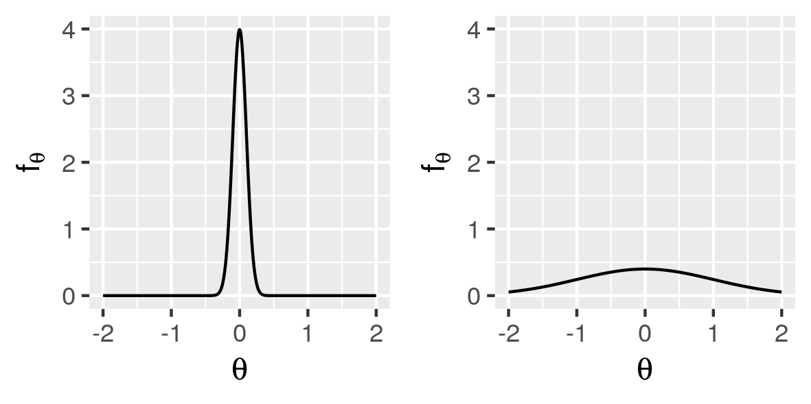{width=13cm} 

Such density functions will describe *prior* and *posterior* beliefs about the parameters, i.e. respectively beliefs we have about them before observing any data and beliefs updated with data and the model. We call them respectively *prior density* and *posterior density*. The former is generally constructed by hand to reflect our state of belief based on prior data or theoretical knowledge. The latter is the result of ABC. For example, the posterior density on the parameter `humanInformProbability` given a `proportionInfected` equal to $a$ will be denoted with a conditional density function like 

$$f_{\texttt{humanInformProbability} | \texttt{proportionInfected} = a}:[0,1] \rightarrow \mathbb{R}_+ .$$

The model zombie takes 3 parameters (`humanInformedRatio`, `humanInformProbability` and `humanFollowProbability`) and outputs multiple values (these will depend on the case study). For simplicity, we will abstract over the parameters and output values by representing them respectively with the random variables $\Theta$ and $Y$, both being multidimensional real-valued. The lowercase letter $\theta, y$ will refer to individual realizations. With this notation, the prior and posterior density are written $f_\Theta$ and $f_{\Theta|Y = y_0}$, where $y_0$ denotes the observed data.


Updating beliefs with data and a simulation model
===

We want to use prior beliefs over parameter values, observed data and the model to refine our beliefs and obtain the posterior density on the parameters. According to Bayes formula, the posterior density is proportional to the prior density times another term called the likelihood:

$$f_{\Theta | Y = y_0}(\theta) \propto f_{Y| \Theta = \theta}(y_0) f_\Theta(\theta) .$$

The prior distribution term is $f_\Theta(\theta)$. It is usually constructed by hand to reflect our subjective state of knowledge over the parameter. Often, we assume no prior knowledge by using a uniform distribution over a reasonnable range of values. That range must be chosen carefully, since any parameter value outside of it --- where the prior density is 0 --- will also have a posterior density equal to 0, even if the data may suggest otherwise. 

The likelihood term is $f_{Y|\Theta=\theta}(y_0)$. It gives the density of a model output value equal to the observed data $y_0$, given the parameter values $\theta$. 

With complex systems models, we may not know how to compute the likelihood directly. But the likelihood is indirectly expressed by a stochastic model: running multiple model simulations keeping the parameter value $\theta$ constant and collecting the output values $y_1, y_2, \dots$ is equivalent to sampling from the distribution of $Y|\Theta=\theta$. ABC aims precisely at approximating the posterior distribution when we cannot compute the likelihood directly but can sample from it with a simulation model.

The resulting posterior density value, $f_{\Theta | Y = y_0}(\theta)$ describes the updated belief that we want to compute. It is the belief on the values that can take the parameter, consistent with both the prior belief and the likelihood. It combines the information they contain.


How ABC works: iterated accept-reject
===

The simple, general idea of ABC is to sample many parameter values from the prior distribution, run one simulation for each and keep those whose output values are equal to the observed data $y_0$. The resulting sample $\theta_1, \dots, \theta_n$ follows the posterior distribution of $\Theta | Y = y_0$. 

With a real-valued output $Y$, keeping only the simulations whose output is equal to $y_0$ is not possible. Instead, we keep those whose outputs are within a euclidean distance $\epsilon$ of $y_0$. It means that ABC actually samples from the distribution of $\Theta | \rho(Y, y_0) < \epsilon$, where $\rho(Y,y_0)$ is the euclidean distance between the model output $Y$ and the observed data $y$. We assume that $\Theta | \rho(Y, y_0) < \epsilon$ is a good approximation of $\Theta | Y = y$ when $\epsilon$ is small.

The approach of Lenormand, Jabot and Deffuant (2012)[^1] implemented in OpenMOLE tries to make $\epsilon$ as small as possible step by step:

[^1]: Source: Lenormand, M., Jabot, F. & Deffuant, G. Comput Stat (2013) 28: 2777. https://doi.org/10.1007/s00180-013-0428-3

- Sample $N$ values $\theta_1, \dots,\theta_N$ from the prior distribution and run one simulation for each to get the sequence of pairs $S = (\theta_1, y_1), \dots, (\theta_N, y_N)$,
- Repeat
    - Sample $N'$ parameter values and run the simulations resulting in a sequence of $N'$ pairs $S' = (\theta'_1, y'_1), \dots, (\theta'_{N'}, y'_{N'})$
    - Replace $S$ by the $N$ pairs from $S$ and $S'$ with the lowest distance from the data $y$.

There, $\epsilon$ is implicitly determined by the highest distance between a simulation output and the data, among the $N$ simulations kept at each step.

As the algorithm progresses, $\epsilon$ will decrease and it will become more and more difficult to generate new simulations that are within a distance $\epsilon$ to the data. We chose to terminate the algorithm when the proportion of simulation accepted among the $m_\textit{stop} \times N$ last simulations (which can be greater than $N'$) decreases below a parameter $p_\textit{Acc}$. 


Practice: Using ABC in OpenMOLE
===

In the OpenMOLE interface, download the entry "ABC" from the market place and have a look at the script `abc.oms`. This script applies ABC to a toy model, a gaussian mixture, but we won't focus on it here. Note only that it takes three parameters and outputs a 3-dimensional vector. Try to guess what parameters passed to the function `IslandABC` correspond to ABC's parameters discussed previously (note the distinction between the model parameters and ABC's parameters). Hint: ABC's parameters are the prior distribution, the observed data, the sample sizes $N$ and $N'$, $p_\textit{Acc}$ and $m_\textit{stop}$.

Run the script. It should take about 3 minutes. Refresh the file list on the left (look at the buttons above the list). The directory "posteriorSample" should appear. It contains the posterior sample given by ABC at each timestep. The last one is the final sample (you can sort the files by date).
Open this file. Each row is a sample point. There is a column for each parameter (here, they are named "theta1", "theta2" and "theta3"). Recall that this is a weighted sample, and the weights are given in the column "weight". The column "rhos" gives the euclidean distance that was computed between the simulation output and the observed data.

Use your favorite method to make a scatter plot of the posterior sample, taking the parameters two by two. Recall that you can do it in only a few clicks in openmole, if you click on the button "Plot" above the current table. Which parameter values seem the most credible, given the data? 

Remember the model zombies with the 3 parameters `humanInformedRatio`, `humanInformProbability` and `humanFollowProbability`. Write an openmole script that runs ABC on it. Use as observed data the time series of people rescued every 20 seconds: `Array(0,5,14,42,36,9,5,3,1,0,0,0,0,0,0,0,0,0,0,0,0,0,0,0,0,0)`

The solution is available [here](openmole/abc_practice_solution.oms).


Practice: Exploiting ABC's output
===

We have defined calibration as finding parameter values consistent with data. We've seen that, with ABC, we are aiming at a calibration procedure that accounts for uncertainty. How does the result of ABC convey uncertainty, and how do we use it?

ABC conveys uncertainty through a sample of values. It follows the posterior density distribution on the parameter given the data. This distribution represents how probable the different parameter values are, according to the data, the model, and the prior distribution.
 
The posterior sample is composed of the sequence of parameter values $(\theta_i)_{i=1}^N$ and their associated weights $w_i$. For example, [this file](samples/step872.csv) contains the result of ABC for the model coop, where the data is a sequence of number of people rescued every 20 seconds. Each row corresponds to one point in the sample. The columns `humanInformedRatio`, `humanInformProbability` and `humanFollowProbability` give the values for the corresponding parameters, and the column `weight` give the point's weight. 

The OpenMOLE task used to obtain this result is (see the [solution to the previous section for the complete OpenMOLE script](openmole/abc_practice_solution.oms)):

```scala
val abc =
  IslandABC(
    evaluation = model,
    prior = Seq(
      humanInformedRatio in (0.0, 1.0),
      humanInformProbability in (0.0, 1.0),
      humanFollowProbability in (0.0, 1.0)),
    observed =  Seq(rescuedDynamic -> Array(0,5,14,42,36,9,5,3,1,0,0,0,0,0,0,0,0,0,0,0,0,0,0,0,0,0)),
    sample = 1000,
    generated = 100,
    minAcceptedRatio = 0.01,
    stopSampleSizeFactor = 5,
    parallelism = 300
  )
```

**Practice:** Use your favorite scripting language to compute the expected value of the parameters. Remember that the sample is weighted. What can you say about this expected value? On its own, does it tell you much about the distribution of parameters given the data? Hint: we would at least like to know how wide is the distribution around this value.


Practice: Estimating the posterior density
===

The first thing we would like to do with the result of ABC is to develop some intuition about which parameter values are the most likely, and which are not. We have a posterior sample, but the posterior density could help us.

We can estimate the posterior density from a sample using kernel density estimation. Let's estimate the posterior density within the context of the [previous section](#practice-exploiting-abcs-output). The posterior density is $f_{\Theta | Y = y_0}$ where $\Theta$ denotes the three parameters `humanInformedRatio`, `humanInformProbability` and `humanFollowProbability`, and $y_0$ denotes the following sequence of number of people rescued every 20 seconds:

$$(0,5,14,42,36,9,5,3,1,0,0,0,0,0,0,0,0,0,0,0,0,0,0,0,0,0) .$$

The R script generating the figures of this section is available [here](report/abc-report.Rmd). The data file containing the posterior sample is [here](samples/step872.csv).

The easiest way to develop intuition about data is through visualisation. Ideally, we would like to plot the posterior density as seen in section [Beliefs as a probability distribution](#beliefs-as-a-probability-distribution).

Let's recall that the model coop has 3 parameters. Since each point in the parameter space has an associated density value, the posterior density is in 4 dimensions. But visualizing 4D data is difficult. To begin with, we can visualise the density of each parameter individually (their marginal densities), as well as each pair of parameters.

Here are the estimated density of individual parameters:

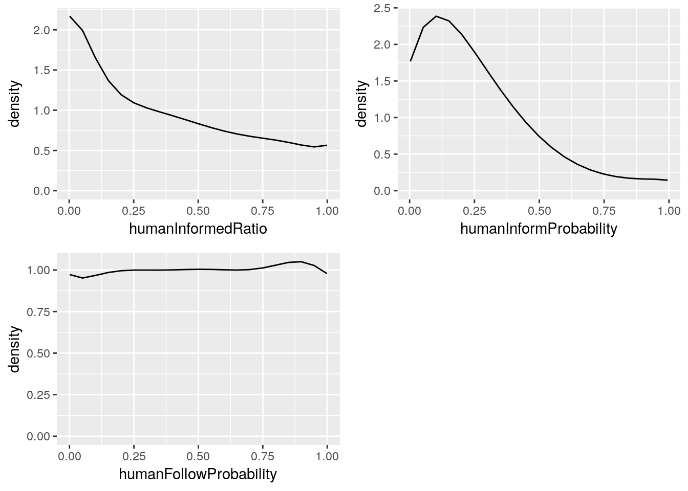{width=20cm}

From these densities we can say that:

- Small values of the parameter `humanInformProbability` are more likely than large values. The most likely values are around 0.1.
- Small values of the parameter `humanInformedRatio` are more likely than large values. The values closest to 0 are the most likely.
- All values of the parameter `humanFollowProbability` are equally likely.  The parameter doesn't seem to influence the probability that the model output is close to the data.

While individual marginals give us some insight, they can hide information of interaction between parameters. Let's examine interactions of parameters 2 by 2:

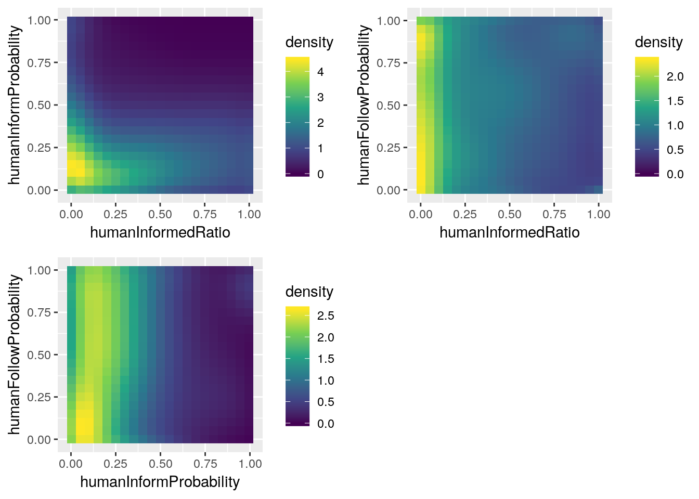{width=20cm}

These densities of parameters taken 2 by 2 confirm our previous intuitions:

- the parameter `humanFollowProbability` doesn't seem to influence how likely each other parameter is: it's value doesn't affect the marginal density of any of the other 2 parameters;
- the most likely values of the parameter are still close to 0 for the parameter `humanInformedRatio` and close to 0.1 for the parameter `humanInformProbability`. 

Finally, let's look at the peaks in the density of all 3 parameters together (the full joint posterior distribution).

```
## # A tibble: 5 x 4
##   humanInformedRatio humanInformProbability humanFollowProbability density
##                <dbl>                  <dbl>                  <dbl>   <dbl>
## 1            0.00205                  0.102               0.0508      5.35
## 2            0.0519                   0.102               0.849       4.23
## 3            0.00205                  0.995               0.899       2.81
## 4            0.850                    0.251               0.899       1.85
## 5            0.999                    0.301               0.000935    1.28
```

The two highest peaks of density are close with respect to the variables `humanInformedRatio` and `humanInformProbability` but far away with respect to the parameter `humanFollowProbability`. This is consistent with our previous observations, i.e. the location of the most likely values of parameters `humanInformedRatio` and `humanInformProbability`, and the flat density on the parameter `humanFollowProbability`.

**Practice:** You can get to similar results using histograms, which are simpler to program. Using your favorite scripting language, compute the equivalent of the 1D marginal above with histograms. Remember that the sample is weighted!


Practice: Hypothesis testing
===

Imagine that before people entered the stadium, the managers took measures to inform everyone about the rescue points. For example, they broadcasted an announcement at the beginning of the show. After the tragic event, they want to know if the message was clear enough that at least half of the people had the information.

With the posterior density, we can compute the probabilities that `humanInformedRatio` was respectively greater than and less than 0.5, and compare them.

The probability that `humanInformedRatio` is greater than 0.5, according to the posterior density, is:

$$\mathbb{P}(\textit{humanInformedRatio} > 0.5 | Y = y_0) = \int_{0.5}^1 f_{\textit{humanInformedRatio}|Y=y_0}(x)dx ,$$

where $y_0$ is the observed sequence of number of rescues. This can be approximated with the weighted sample that we got from ABC by:

$$\mathbb{P}(\textit{humanInformedRatio} > 0.5 | Y = y_0) \approx \frac{1}{\sum_{i=1}^n w_i} \sum_{i=1}^n w_i \textbf{1}_{[0.5,1]}(\textit{humanInformedRatio}_i) .$$

Where $w_i$ is the weight associated to the $i$-th sample point, $\textbf{1}$ is the indicator function ($\textbf{1}_{[0.5, 1]}(\textit{x}) = 1$ if $\textit{x} \in [0.5,1]$, $0$ otherwise), $\textit{humanInformedRatio}_i$ is the value of the parameter `humanInformedRatio` of the  $i$-th sample point.

Similarly, the probability that `humanInformedRatio` was less than 0.5 is approximated by:

$$\mathbb{P}(\textit{humanInformedRatio} < 0.5 | Y = y_0) \approx \frac{1}{\sum_{i=1}^n w_i} \sum_{i=1}^n w_i \textbf{1}_{[0,0.5]}(\textit{humanInformedRatio}_i) .$$

**Practice:** We ran ABC with the settings used [previously](#practice-exploiting-abcs-output). Use the posterior sample in [this file](samples/step872.csv) and your favorite scripting language to compute the ratio $\frac{\mathbb{P}(\textit{humanInformedRatio} > 0.5 | Y = y_0)}
{\mathbb{P}(\textit{humanInformedRatio} < 0.5 | Y = y_0)}$.

This ratio tells us how much more probable is the hypothesis that more than half the humans were informed that the alternative. What can you conclude about the hypothesis that at least half of the people were aware of the rescue zones?


Practice: Forecasting
===

We can make predictions consistent with our inference's uncertainty using the posterior sample. If we run a simulation using the parameter values from each row in the posterior sample and take each output value, we get a prediction sample. This sample follows the distribution of output values predicted by the inferred model.

For example, the expected value of the predicted total number of people rescued during an attack according to the inferred model is approximated by

$$\mathbb{E}[\textit{totalRescued}|Y=y] = \sum_{i=1}^n \frac{w_i}{\sum_{j=1}^n w_j} \textit{totalRescued}_i ,$$

Where $\textit{totalRescued}_i$ is the total number of people rescued for the simulation run corresponding to the $i$-th posterior sample point, and $w_i$ is the associated weight.

**Practice:** [This file](samples/posteriorPredictionTotalRescued.csv) contains the prediction  sample of the total number of rescues, obtained from the [posterior sample](samples/step872.csv) used [previously](#practice-exploiting-abcs-output). It was obtained using [this OpenMOLE script](openmole/abc_predict_totalRescued.oms). Compute the predicted 5-percentile and 95-percentile of the total number of people rescued. Based on the width of this interval, how confident are you to make a prediction?

Does the observed data fall within the 90% prediction interval you just computed? This is called a posterior predictive check. Such tests are important. They consist in making sure that the observed data is sufficiently likely according to the inferred model. If not, then there may be a problem with the model or the inference.


Choosing summary statistics or the curse of dimensionality
===

ABC's success depends on the information we use to compare the model output and the data. [We have seen](#how-abc-works-iterated-accept-reject) that ABC samples from the distribution of $\Theta | \rho(Y,y_0) < \epsilon$, where $\rho(Y,y_0)$ is the euclidean distance between the model output and the data. We use this distribution as an approximation of the distribution of $\Theta | Y = y_0$, which we are ideally interested in. In order for this approximation to be reasonable, $\epsilon$ must be small. The euclidean distance is affected by what information is contained in the values of $Y$ and $y_0$, called the *summary statistics*.

Previously, we ran ABC on the model zombie using as summary statistics the sequence of number of rescues every 20 seconds. It forms a vector of 26 values. Alternatively, we could have used more detailed information, such as the number of rescues every second, forming a vector in about 500 dimensions. Or we could have used more aggregated information, like the total number of rescues for the whole simulation.

In order for ABC to work well, the summary statistics needs to satisfy two constraints: be *sufficient* for the parameters, and avoid the curse of dimensionality. 

A summary statistics is sufficient for a parameter if they provide as much information as the full dataset to estimate the parameter. It would be tempting to add as much information as possible into the summary statistics, but as we do so, ABC suffers from the curse of dimensionality.

As the number of dimensions increases, it becomes more difficult to get small values for $\epsilon$. Recall that the [fondamental principle of ABC](#how-abc-works-iterated-accept-reject) is to sample parameter values from the prior distribution and keep those which result in an output close to the observed data. The curse of dimensionality implies that the chance of sampling output values close to the observed data decreases as the number of dimensions increases, affecting the value of $\epsilon$. Since ABC samples from the distribution of $\Theta | \rho(Y, y_0) < \epsilon$, aiming for small $\epsilon$ to approximate $\Theta | Y = y_0$, the approximation deteriorates.

Let's compare the estimated posterior marginal densities of each parameter from the result of ABC using respectively the total number of rescues ($\in \mathbb{R}$), the number of rescues every 20 seconds ($\in \mathbb{R}^{26}$) and the number of rescues every second ($\in \mathbb{R}^{500}$):

**Total number of rescues:**

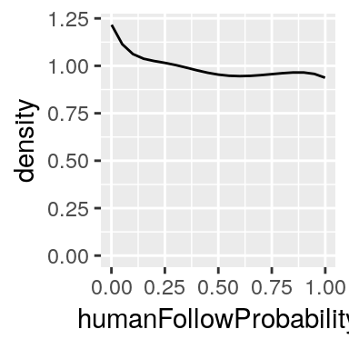{width=6.5cm}
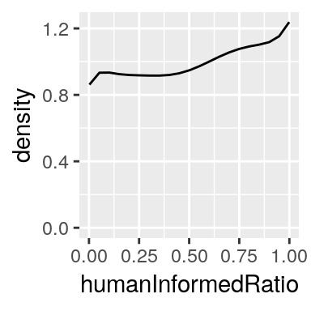{width=6.5cm}
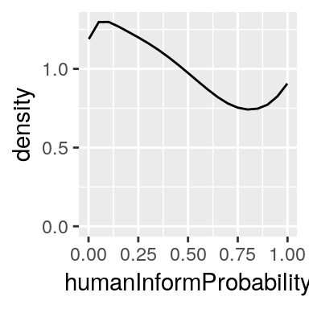{width=6.5cm}


**Number of rescues every 20 seconds:**

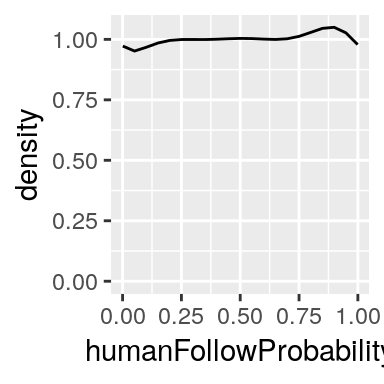{width=6.5cm}
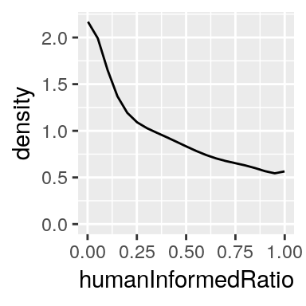{width=6.5cm}
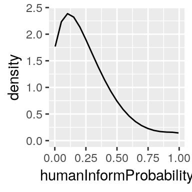{width=6.5cm}

**Number of rescues every second:**

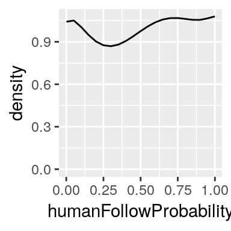{width=6.5cm}
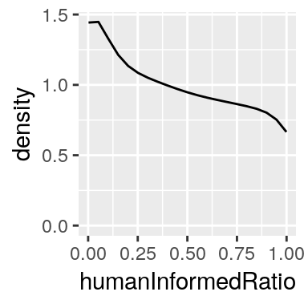{width=6.5cm}
{width=6.5cm}

There are notable differences between the estimated marginals. In the first row, the three marginals are almost flat, suggesting that the summary statistic is not sufficient for the parameters. The second and third rows differ in the peak of the marginal for the parameter `humanInformProbability`: it is located around 0.1 in the second row and close to 0 in the third. Without any knowledge about the expected density that we are trying to estimate, it is hard to know which one is the most accurate. 

A strategy to evaluate the quality of the whole inference process is to use simulation to generate pairs of parameter values and output values, and compare the result of ABC on each output value to the corresponding parameter value. The observed data we used in the previous applications of ABC was actually generated by a simulation run using the value 0.09 for `humanInformProbability`. We are thus tempted to say that using the summary statistics in 20 dimensions gives better results than using the most detailed summary statistics in 500 dimensions.


